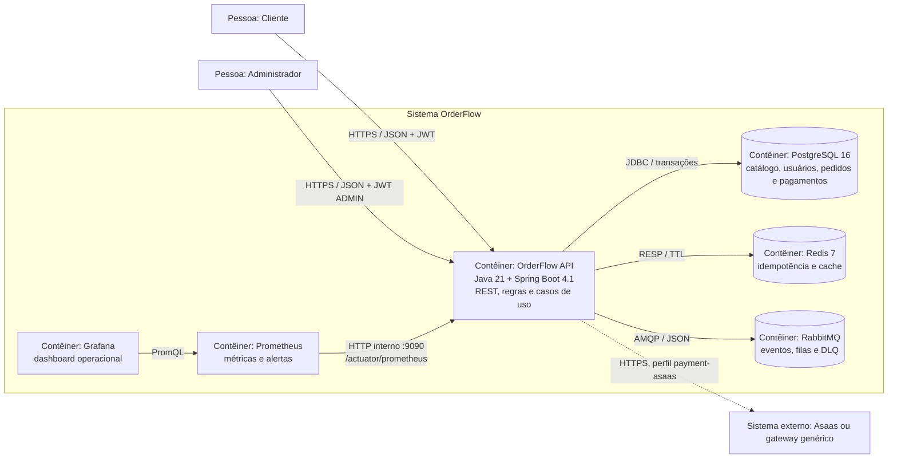

# OrderFlow

[](https://github.com/OliveiratheDev/order-flow/actions/workflows/ci.yml)

Backend de pedidos e cobrança para e-commerce, construído como projeto de estudo e
portfólio com Java 21 e Spring Boot. O sistema reúne catálogo, autenticação JWT, pedidos
com reserva de estoque, pagamentos e idempotência em um monólito modular executável com
Docker.

O projeto prioriza decisões justificadas e comportamento verificável: schema versionado por
Flyway, erros HTTP em `ProblemDetail`, domínio sem setters genéricos, pagamento isolado por
Ports & Adapters e testes com PostgreSQL e Redis reais via Testcontainers.

## Funcionalidades

- cadastro e autenticação stateless com JWT e senhas BCrypt;
- autorização de operações administrativas por papel;
- CRUD, filtros e paginação de categorias e produtos;
- ajuste e reserva transacional de estoque;
- criação idempotente de pedidos com Redis;
- máquina de estados do pedido, do pagamento à entrega;
- eventos de domínio de pedido vinculados ao commit, com auditoria transacional e métricas;
- topologia RabbitMQ declarada em código, com filas duráveis, roteamento por tópico e DLQ;
- publicação persistente de eventos criado, pago e cancelado somente após o commit;
- pagamentos com domínio hexagonal, gateway substituível e adapter para o Sandbox Asaas;
- resiliência financeira com timeout, circuit breaker, retry seguro e fallback pendente;
- webhook Asaas autenticado, idempotente e auditado, com tratamento de confirmação, recusa
  e estorno;
- conciliação periódica de cobranças pendentes com lock distribuído e revisão manual de
  divergências financeiras;
- contrato de erros seguro baseado em RFC 9457;
- Correlation ID propagado na resposta, nos logs e no gateway;
- Actuator em porta operacional, métricas Prometheus, dashboard Grafana, alertas, logs JSON
  em produção e CI com cobertura mínima.

## Stack

| Área | Tecnologias |
|---|---|
| Runtime | Java 21, Spring Boot 4.1, Maven Wrapper |
| API | Spring MVC, Validation, Springdoc OpenAPI |
| Segurança | Spring Security, OAuth2 Resource Server, JWT HS256, BCrypt |
| Persistência | Spring Data JPA, Hibernate, PostgreSQL 16, Flyway |
| Estado distribuído | Redis 7 para idempotência e cache |
| Mensageria | RabbitMQ 3.13, Spring AMQP 4.1, JSON e Dead Letter Queue |
| Resiliência | Resilience4j 2.4 para timeout, retry, circuit breaker e métricas |
| Agendamento | Spring Scheduling e ShedLock 7.7 com lock no PostgreSQL |
| Mapeamento | MapStruct; Lombok usado de forma conservadora |
| Qualidade | JUnit 5, Mockito, MockMvc, Testcontainers, JaCoCo |
| Operação | Docker multi-stage, Docker Compose, Actuator, Prometheus 3.13, Grafana 13.1, logs estruturados |

## Arquitetura

O OrderFlow é um **monólito modular por domínio**. Catálogo, identidade e pedidos usam
camadas; `payment` usa arquitetura hexagonal porque precisa isolar um gateway externo
instável e substituível.

### C4 — nível Contêiner



Os packages principais são:

```text
com.start.overflow
├── catalog       # categorias e produtos; arquitetura em camadas
├── identity      # usuários, autenticação e autorização
├── order         # pedidos, estoque e máquina de estados
├── payment       # domain, ports, application e adapters
└── shared        # erros, idempotência, configuração e observabilidade
```

Leia a [visão técnica detalhada](docs/PROJECT_OVERVIEW.md) e o
[índice de decisões arquiteturais](docs/adr/README.md).

## Padrões de projeto aplicados

| Padrão | Aplicação | Código |
|---|---|---|
| State | Cada estado define transições válidas do pedido | [`OrderState`](src/main/java/com/start/overflow/order/state/OrderState.java) |
| Builder | Monta o agregado pedido e valida seus itens antes de criá-lo | [`CustomerOrder.Builder`](src/main/java/com/start/overflow/order/entity/CustomerOrder.java) |
| Strategy | Gateways aprovado, recusado e HTTP implementam o mesmo contrato | [`PaymentGatewayPort`](src/main/java/com/start/overflow/payment/ports/out/PaymentGatewayPort.java) |
| Ports & Adapters | Mantém domínio de pagamento independente de HTTP, JPA e Spring | [`payment`](src/main/java/com/start/overflow/payment) |
| Repository | Isola consultas e persistência dos casos de uso | [`ProductRepository`](src/main/java/com/start/overflow/catalog/repository/ProductRepository.java) |
| Mapper | Converte entidades e DTOs sem expor o modelo JPA | [`CategoryMapper`](src/main/java/com/start/overflow/catalog/mapper/CategoryMapper.java) |
| Aspect | Aplica idempotência como responsabilidade transversal | [`IdempotencyAspect`](src/main/java/com/start/overflow/shared/idempotency/IdempotencyAspect.java) |
| Observer | Reage a fatos do pedido sem acoplar o service aos consumidores | [`OrderDomainEvent`](src/main/java/com/start/overflow/order/event/OrderDomainEvent.java) |

## Início rápido com Docker

Pré-requisitos: Docker Desktop com Compose e portas `8080`, `3000`, `5433`, `6380`, `5672`,
`9090` e `15672` livres.
Não é necessário instalar Maven: o build usa o Wrapper versionado no repositório.

```bash
docker compose up --build -d
docker compose ps
```

O Compose inicia API, PostgreSQL, Redis, RabbitMQ, Prometheus e Grafana, aguarda os health
checks e executa as migrations Flyway automaticamente. Para acompanhar a aplicação:

```bash
docker compose logs -f app
```

Serviços locais:

| Serviço | Endereço |
|---|---|
| API | `http://localhost:8080` |
| Swagger UI | `http://localhost:8080/swagger-ui.html` |
| OpenAPI JSON | `http://localhost:8080/v3/api-docs` |
| Prometheus | `http://localhost:9090` |
| Grafana | `http://localhost:3000` |
| PostgreSQL | `localhost:5433` |
| Redis | `localhost:6380` |
| RabbitMQ AMQP | `localhost:5672` |
| RabbitMQ Management UI | `http://localhost:15672` |

A UI usa `RABBITMQ_USER` e `RABBITMQ_PASSWORD` do `.env`. No ambiente local sem override,
ambos são `orderflow`; não use esses defaults fora da máquina de desenvolvimento.
O Grafana usa `GRAFANA_ADMIN_USER` e `GRAFANA_ADMIN_PASSWORD`; a senha de produção é
obrigatória e deve ficar somente no gerenciador de segredos ou no `.env` não versionado.
O Actuator da aplicação Docker escuta apenas na rede interna, na porta `9090`.

Se `8080` já estiver ocupada, defina outra porta antes de subir o ambiente:

```powershell
$env:APP_PORT = "8081"
docker compose up --build -d
```

```bash
APP_PORT=8081 docker compose up --build -d
```

O ambiente Docker local cria, se necessário, um administrador de demonstração:

- e-mail: `admin@orderflow.local`
- senha: `LocalAdmin123!`

Essas credenciais existem somente para desenvolvimento. Altere-as por variáveis de ambiente
se o ambiente puder ser acessado por outras pessoas.

## Executar durante o desenvolvimento

Suba somente a infraestrutura:

```bash
docker compose up -d postgres redis
```

No PowerShell:

```powershell
$env:JWT_SECRET = "segredo-local-com-mais-de-trinta-e-dois-bytes"
$env:BOOTSTRAP_ADMIN_PASSWORD = "LocalAdmin123!"
.\mvnw.cmd spring-boot:run "-Dspring-boot.run.profiles=dev"
```

No Bash:

```bash
JWT_SECRET='segredo-local-com-mais-de-trinta-e-dois-bytes' \
BOOTSTRAP_ADMIN_PASSWORD='LocalAdmin123!' \
./mvnw spring-boot:run -Dspring-boot.run.profiles=dev
```

## Demonstrar a API

O arquivo [`http/orderflow.http`](http/orderflow.http) contém o fluxo completo:

1. registrar cliente e autenticar administrador;
2. criar categoria e produto;
3. criar e repetir um pedido com a mesma chave de idempotência;
4. pagar, enviar e entregar o pedido;
5. consultar o estado final e o estoque.

O arquivo funciona no HTTP Client do IntelliJ IDEA. Também é possível executar os mesmos
passos pelo Swagger; use o token retornado pelo login no botão **Authorize**.

## Segurança e contrato HTTP

- leituras de catálogo e endpoints de autenticação são públicos;
- alterações de catálogo e envio/entrega de pedidos exigem `ADMIN`;
- pedidos e pagamentos exigem JWT válido;
- `POST /api/v1/webhooks/asaas` não usa JWT: ele exige o header privado
  `asaas-access-token` e existe apenas com o profile `payment-asaas`;
- o cadastro de cliente exige CPF/CNPJ para criar o pagador no gateway, mas esse dado não é
  devolvido nas respostas públicas;
- `POST /api/v1/orders` exige `Idempotency-Key` de até 128 caracteres seguros;
- respostas incluem `X-Correlation-Id`; um valor válido enviado pelo cliente é propagado;
- falhas seguem `application/problem+json` e não expõem SQL, constraints ou stack traces.

## Contrato dos eventos de pedido

Todos os eventos são publicados no exchange `order.events` somente em
`AFTER_COMMIT`. O envelope JSON comum possui `eventId`, `eventType`, `eventVersion`,
`occurredAt`, `correlationId` e `payload`. A versão inicial de todos os contratos é `1`.

| Evento | Routing key | Payload v1 | Gatilho | Filas atuais |
|---|---|---|---|---|
| `OrderCreated` | `order.created` | `orderId`, `customerId`, `total`, `items[]` | pedido persistido | `notification.order-created`, `audit.queue` |
| `OrderPaid` | `order.paid` | `orderId`, `customerId`, `total` | pagamento confirmado | `notification.order-paid`, `audit.queue` |
| `OrderCancelled` | `order.cancelled` | `orderId`, `customerId`, `total` | cancelamento confirmado | `audit.queue` |

Cada item de `OrderCreated` contém `productId`, `productName`, `sku`, `quantity`,
`unitPrice` e `lineTotal`. Mensagens usam delivery mode persistente; o publicador aguarda o
confirm correlacionado por até `RABBITMQ_PUBLISHER_CONFIRM_TIMEOUT` e trata retorno sem
binding como falha. A falha registra identificadores, versão, routing key e correlação, sem
copiar o payload para o log, além da métrica
`orderflow.messaging.order_event.publications` (`event.type` e `result`).

O commit PostgreSQL e a publicação AMQP não são atômicos. `AFTER_COMMIT` impede evento de
transação revertida, mas ainda existe uma janela em que o pedido foi confirmado e o broker
não recebeu a mensagem. O [ADR-004](docs/adr/0004-publicacao-pos-commit-e-outbox.md) registra
esse risco e o Outbox como evolução.

## Consumo e notificação de pagamento

`OrderPaidNotificationListener` consome `notification.order-paid`, restaura o
`correlationId` no MDC e traduz o envelope para um comando da aplicação. A regra fica no
`PaymentNotificationService`, sem dependência de RabbitMQ. O e-mail é simulado por um registro
em `notification_delivery` e por log estruturado.

A entrega é *at-least-once*. `processed_event` usa a chave primária composta
`(event_id, consumer)` para impedir duas notificações do mesmo consumidor, inclusive quando
duas threads recebem a mensagem simultaneamente. A reserva e a notificação simulada são
gravadas na mesma transação; se o efeito falha, a marca também sofre rollback. Um evento
`OrderPaid` não depende da chegada anterior de `OrderCreated`, portanto funciona fora de
ordem. O expurgo diário remove marcas e entregas simuladas com mais de 30 dias.

Falhas transitórias têm duas repetições com backoff de 1 e 2 segundos, totalizando três
tentativas. JSON inválido, versão incompatível e regra determinística são rejeitados sem retry.
Como `default-requeue-rejected=false`, a rejeição chega a `order.events.dlq` e não entra em
loop na fila de trabalho.

### Operação da DLQ

- **Alerta:** trate `messages_ready > 0` em `order.events.dlq` como incidente; até a entrega
  dos dashboards, consulte a Management UI do RabbitMQ.
- **Diagnóstico:** registre `eventId`, payload, routing key e os headers `x-death`, incluindo
  fila de origem, motivo e contagem.
- **Reprocessamento:** corrija a causa, valide a versão do contrato e devolva somente as
  mensagens selecionadas para a routing key original. A PK de idempotência torna o reenvio
  seguro dentro da retenção.
- **Descarte:** remova uma mensagem apenas quando ela não for mais relevante, mantendo um
  registro operacional do `eventId`, motivo, responsável e data.

## Observabilidade operacional

O Actuator expõe somente `health`, `info`, `metrics`, `prometheus` e `circuitbreakers`.
No Compose, a porta de gerenciamento `9090` da aplicação permanece interna; o Prometheus
coleta `/actuator/prometheus` a cada 15 segundos e o Grafana já recebe a fonte de dados e o
dashboard **OrderFlow — Visão operacional** por provisionamento versionado.

| Métrica no código/Actuator | Série principal no Prometheus | Tags controladas |
|---|---|---|
| `orderflow.orders.created` | `orderflow_orders_total` | `status` |
| `orderflow.payments.failed` | `orderflow_payments_failed_total` | `gateway`, `reason` |
| `orderflow.payment.gateway.duration` | `orderflow_payment_gateway_duration_seconds_*` | `gateway`, `operation` |
| `orderflow.reconciliation.divergences` | `orderflow_reconciliation_divergences_total` | `type` |
| `orderflow.dlq.depth` | `orderflow_dlq_depth` | nenhuma |

O dashboard está disponível em
`http://localhost:3000/d/orderflow-overview/orderflow-visao-operacional` e contém:

- requisições por segundo e taxa de erro HTTP;
- latência HTTP p50, p95 e p99;
- circuit breakers abertos;
- pedidos criados por minuto;
- profundidade da DLQ;
- latência do gateway p50, p95 e p99.

O Prometheus carrega cinco alertas versionados: aplicação indisponível, taxa de erro HTTP
acima de 5%, latência p95 acima de dois segundos, circuit breaker aberto e DLQ não vazia.
Para gerar dados, execute o fluxo de [`http/orderflow.http`](http/orderflow.http), aguarde ao
menos um intervalo de coleta e selecione os últimos 15 minutos no dashboard.

## Testes e qualidade

Com o Docker ativo, execute toda a verificação:

```powershell
.\mvnw.cmd verify
```

```bash
./mvnw verify
```

Os testes de integração sobem PostgreSQL 16, Redis 7 e RabbitMQ 3.13 isolados via
Testcontainers. A suíte de mensageria valida publicação após commit, ausência de mensagem no
rollback, roteamento, auditoria, consumo idempotente, retry, DLQ e serialização sem usar esperas
fixas. O JaCoCo interrompe o build abaixo de 70% de cobertura de linhas. O relatório fica em
`target/site/jacoco/index.html`.

Última validação local da baseline em 09/08/2026: **167 testes aprovados** e **88,03% de
cobertura de linhas**.

## Configuração e produção

Segredos não são versionados. Consulte [`.env.example`](.env.example) para conhecer as
variáveis e [`docs/DEPLOYMENT.md`](docs/DEPLOYMENT.md) para o procedimento de implantação.

Pontos importantes:

- `prod` exige PostgreSQL, Redis, RabbitMQ e `JWT_SECRET`; Swagger e bootstrap de
  administrador ficam desativados;
- logs do perfil `prod` são JSON e incluem contexto de correlação;
- logs dos profiles `dev` e `docker` permanecem legíveis e exibem correlação, usuário e
  campos estruturados;
- o gateway padrão é um simulador determinístico, adequado à demonstração do portfólio;
- o Sandbox Asaas é ativado com `docker,payment-asaas`; a chave fica somente no `.env`;
- produção usa `prod,payment-asaas` e `https://api.asaas.com/v3`; o webhook já está
  implementado e a integração possui timeout, circuit breaker, fallback e conciliação
  periódica com lock distribuído;
- o Compose de produção inclui Caddy, publica somente HTTP/HTTPS, emite e renova TLS e
  impede acesso público ao Swagger e ao Actuator;
- `ORDERFLOW_DOMAIN` e `GRAFANA_DOMAIN` devem apontar para a VPS antes do primeiro deploy;
- DNS, firewall, backup e segredos da VPS continuam sendo responsabilidades operacionais.

## Documentos

- [Visão técnica e fluxos](docs/PROJECT_OVERVIEW.md)
- [Guia de implantação](docs/DEPLOYMENT.md)
- [Solução de problemas](docs/TROUBLESHOOTING.md)
- [Architecture Decision Records](docs/adr/README.md)
- [ADR-001 — Monólito modular com `payment` hexagonal](docs/adr/0001-monolito-modular-com-payment-hexagonal.md)
- [ADR-002 — Camadas versus arquitetura hexagonal](docs/adr/ADR-002-camadas-vs-hexagonal-em-pagamentos.md)
- [ADR-003 — Eventos de pedido preservam a consistência transacional](docs/adr/0003-eventos-de-pedido-e-consistencia-transacional.md)
- [ADR-004 — Publicação pós-commit com Outbox como evolução](docs/adr/0004-publicacao-pos-commit-e-outbox.md)

## Limites conhecidos

O envio de e-mail é deliberadamente simulado; SMTP/Mailhog não faz parte da entrega atual.
Refresh token e um gateway de pagamento contratado também não fazem parte da baseline.
