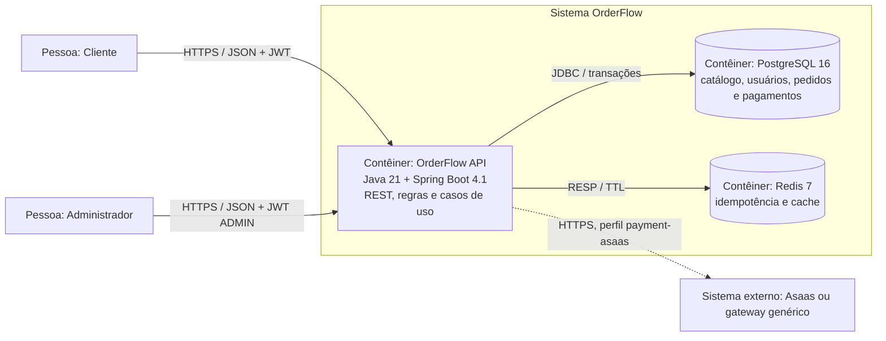

# OrderFlow

[](https://github.com/OliveiratheDev/order-flow/actions/workflows/ci.yml)

Backend de pedidos e cobrança para e-commerce, construído como projeto de estudo e
portfólio com Java 21 e Spring Boot. O sistema reúne catálogo, autenticação JWT, pedidos
com reserva de estoque, pagamentos e idempotência em um monólito modular executável com
Docker.

O projeto prioriza decisões justificadas e comportamento verificável: schema versionado por
Flyway, erros HTTP em `ProblemDetail`, domínio sem setters genéricos, pagamento isolado por
Ports & Adapters e testes com PostgreSQL e Redis reais via Testcontainers.

## Funcionalidades

- cadastro e autenticação stateless com JWT e senhas BCrypt;
- autorização de operações administrativas por papel;
- CRUD, filtros e paginação de categorias e produtos;
- ajuste e reserva transacional de estoque;
- criação idempotente de pedidos com Redis;
- máquina de estados do pedido, do pagamento à entrega;
- pagamentos com domínio hexagonal, gateway substituível e adapter para o Sandbox Asaas;
- webhook Asaas autenticado, idempotente e auditado, com tratamento de confirmação, recusa
  e estorno;
- contrato de erros seguro baseado em RFC 9457;
- Correlation ID propagado na resposta, nos logs e no gateway;
- Actuator, OpenAPI/Swagger, logs JSON em produção e CI com cobertura mínima.

## Stack

| Área | Tecnologias |
|---|---|
| Runtime | Java 21, Spring Boot 4.1, Maven Wrapper |
| API | Spring MVC, Validation, Springdoc OpenAPI |
| Segurança | Spring Security, OAuth2 Resource Server, JWT HS256, BCrypt |
| Persistência | Spring Data JPA, Hibernate, PostgreSQL 16, Flyway |
| Estado distribuído | Redis 7 para idempotência e cache |
| Mapeamento | MapStruct; Lombok usado de forma conservadora |
| Qualidade | JUnit 5, Mockito, MockMvc, Testcontainers, JaCoCo |
| Operação | Docker multi-stage, Docker Compose, Actuator, logs estruturados |

## Arquitetura

O OrderFlow é um **monólito modular por domínio**. Catálogo, identidade e pedidos usam
camadas; `payment` usa arquitetura hexagonal porque precisa isolar um gateway externo
instável e substituível.

### C4 — nível Contêiner



Os packages principais são:

```text
com.start.overflow
├── catalog       # categorias e produtos; arquitetura em camadas
├── identity      # usuários, autenticação e autorização
├── order         # pedidos, estoque e máquina de estados
├── payment       # domain, ports, application e adapters
└── shared        # erros, idempotência, configuração e observabilidade
```

Leia a [visão técnica detalhada](docs/PROJECT_OVERVIEW.md) e o
[índice de decisões arquiteturais](docs/adr/README.md).

## Padrões de projeto aplicados

| Padrão | Aplicação | Código |
|---|---|---|
| State | Cada estado define transições válidas do pedido | [`OrderState`](src/main/java/com/start/overflow/order/state/OrderState.java) |
| Builder | Monta o agregado pedido e valida seus itens antes de criá-lo | [`CustomerOrder.Builder`](src/main/java/com/start/overflow/order/entity/CustomerOrder.java) |
| Strategy | Gateways aprovado, recusado e HTTP implementam o mesmo contrato | [`PaymentGatewayPort`](src/main/java/com/start/overflow/payment/ports/out/PaymentGatewayPort.java) |
| Ports & Adapters | Mantém domínio de pagamento independente de HTTP, JPA e Spring | [`payment`](src/main/java/com/start/overflow/payment) |
| Repository | Isola consultas e persistência dos casos de uso | [`ProductRepository`](src/main/java/com/start/overflow/catalog/repository/ProductRepository.java) |
| Mapper | Converte entidades e DTOs sem expor o modelo JPA | [`CategoryMapper`](src/main/java/com/start/overflow/catalog/mapper/CategoryMapper.java) |
| Aspect | Aplica idempotência como responsabilidade transversal | [`IdempotencyAspect`](src/main/java/com/start/overflow/shared/idempotency/IdempotencyAspect.java) |

## Início rápido com Docker

Pré-requisitos: Docker Desktop com Compose e portas `8080`, `5433` e `6380` livres.
Não é necessário instalar Maven: o build usa o Wrapper versionado no repositório.

```bash
docker compose up --build -d
docker compose ps
```

O Compose inicia a API, PostgreSQL e Redis, aguarda os health checks e executa as migrations
Flyway automaticamente. Para acompanhar a aplicação:

```bash
docker compose logs -f app
```

Serviços locais:

| Serviço | Endereço |
|---|---|
| API | `http://localhost:8080` |
| Health check | `http://localhost:8080/actuator/health` |
| Swagger UI | `http://localhost:8080/swagger-ui.html` |
| OpenAPI JSON | `http://localhost:8080/v3/api-docs` |
| PostgreSQL | `localhost:5433` |
| Redis | `localhost:6380` |

Se `8080` já estiver ocupada, defina outra porta antes de subir o ambiente:

```powershell
$env:APP_PORT = "8081"
docker compose up --build -d
```

```bash
APP_PORT=8081 docker compose up --build -d
```

O ambiente Docker local cria, se necessário, um administrador de demonstração:

- e-mail: `admin@orderflow.local`
- senha: `LocalAdmin123!`

Essas credenciais existem somente para desenvolvimento. Altere-as por variáveis de ambiente
se o ambiente puder ser acessado por outras pessoas.

## Executar durante o desenvolvimento

Suba somente a infraestrutura:

```bash
docker compose up -d postgres redis
```

No PowerShell:

```powershell
$env:JWT_SECRET = "segredo-local-com-mais-de-trinta-e-dois-bytes"
$env:BOOTSTRAP_ADMIN_PASSWORD = "LocalAdmin123!"
.\mvnw.cmd spring-boot:run "-Dspring-boot.run.profiles=dev"
```

No Bash:

```bash
JWT_SECRET='segredo-local-com-mais-de-trinta-e-dois-bytes' \
BOOTSTRAP_ADMIN_PASSWORD='LocalAdmin123!' \
./mvnw spring-boot:run -Dspring-boot.run.profiles=dev
```

## Demonstrar a API

O arquivo [`http/orderflow.http`](http/orderflow.http) contém o fluxo completo:

1. registrar cliente e autenticar administrador;
2. criar categoria e produto;
3. criar e repetir um pedido com a mesma chave de idempotência;
4. pagar, enviar e entregar o pedido;
5. consultar o estado final e o estoque.

O arquivo funciona no HTTP Client do IntelliJ IDEA. Também é possível executar os mesmos
passos pelo Swagger; use o token retornado pelo login no botão **Authorize**.

## Segurança e contrato HTTP

- leituras de catálogo e endpoints de autenticação são públicos;
- alterações de catálogo e envio/entrega de pedidos exigem `ADMIN`;
- pedidos e pagamentos exigem JWT válido;
- `POST /api/v1/webhooks/asaas` não usa JWT: ele exige o header privado
  `asaas-access-token` e existe apenas com o profile `payment-asaas`;
- o cadastro de cliente exige CPF/CNPJ para criar o pagador no gateway, mas esse dado não é
  devolvido nas respostas públicas;
- `POST /api/v1/orders` exige `Idempotency-Key` de até 128 caracteres seguros;
- respostas incluem `X-Correlation-Id`; um valor válido enviado pelo cliente é propagado;
- falhas seguem `application/problem+json` e não expõem SQL, constraints ou stack traces.

## Testes e qualidade

Com o Docker ativo, execute toda a verificação:

```powershell
.\mvnw.cmd verify
```

```bash
./mvnw verify
```

Os testes de integração sobem PostgreSQL 16 e Redis 7 isolados via Testcontainers. O JaCoCo
interrompe o build abaixo de 70% de cobertura de linhas. O relatório fica em
`target/site/jacoco/index.html`.

Última validação local da baseline em 09/08/2026: **84 testes aprovados** e **85,35% de
cobertura de linhas**.

## Configuração e produção

Segredos não são versionados. Consulte [`.env.example`](.env.example) para conhecer as
variáveis e [`docs/DEPLOYMENT.md`](docs/DEPLOYMENT.md) para o procedimento de implantação.

Pontos importantes:

- `prod` exige PostgreSQL, Redis e `JWT_SECRET`; Swagger e bootstrap de administrador ficam
  desativados;
- logs do perfil `prod` são JSON e incluem contexto de correlação;
- o gateway padrão é um simulador determinístico, adequado à demonstração do portfólio;
- o Sandbox Asaas é ativado com `docker,payment-asaas`; a chave fica somente no `.env`;
- produção usa `prod,payment-asaas` e `https://api.asaas.com/v3`; o webhook já está
  implementado, mas resiliência e conciliação periódica ainda precisam ser concluídas;
- domínio, DNS, certificado TLS e reverse proxy pertencem à infraestrutura de destino e não
  são criados pelo Compose desta baseline.

## Documentos

- [Visão técnica e fluxos](docs/PROJECT_OVERVIEW.md)
- [Guia de implantação](docs/DEPLOYMENT.md)
- [Solução de problemas](docs/TROUBLESHOOTING.md)
- [Architecture Decision Records](docs/adr/README.md)
- [ADR-001 — Monólito modular com `payment` hexagonal](docs/adr/0001-monolito-modular-com-payment-hexagonal.md)
- [ADR-002 — Camadas versus arquitetura hexagonal](docs/adr/ADR-002-camadas-vs-hexagonal-em-pagamentos.md)

## Limites conhecidos

Esta baseline não inclui RabbitMQ, Prometheus, Grafana, refresh token nem um gateway de
pagamento contratado. Esses itens pertencem à evolução planejada; a documentação não os
representa como recursos já entregues.
