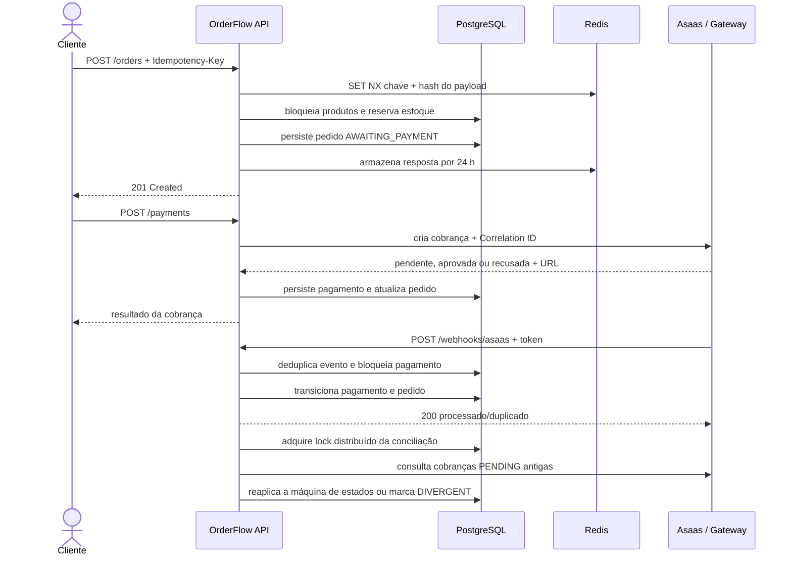
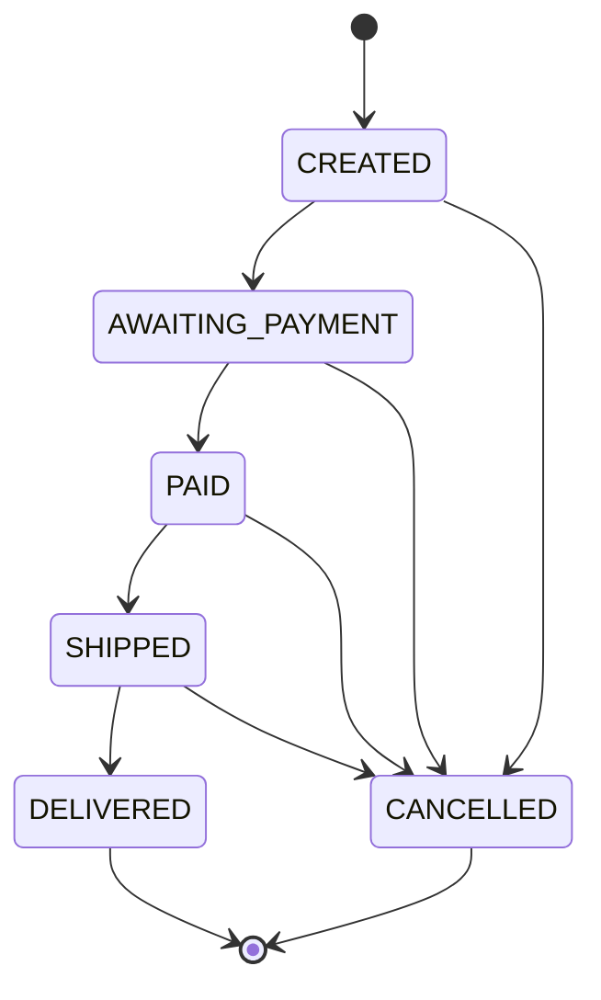
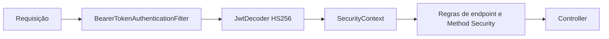

# Visão técnica do OrderFlow

## Objetivo

O OrderFlow simula o backend de um e-commerce com foco em decisões esperadas em um time
real: contrato HTTP previsível, regras de domínio protegidas, persistência versionada,
segurança, testes de integração e operação reproduzível.

A aplicação cobre o caminho principal entre catálogo e cobrança:

## Fronteiras dos módulos

### `catalog`

Mantém categorias, produtos, preço, ativação e estoque. As entidades protegem invariantes;
services coordenam transações e repositories usam consultas parametrizadas. A reserva de
estoque usa bloqueio pessimista para impedir que pedidos concorrentes vendam a mesma unidade.

### `identity`

Registra clientes, autentica com `DaoAuthenticationProvider` e BCrypt e emite JWT HS256. A
API é stateless: cada requisição protegida passa pelo Bearer Token Filter e popula o
`SecurityContext`. O token carrega o papel usado para autorizar endpoints administrativos.

### `order`

Cria o agregado `CustomerOrder`, copia preço para os itens, calcula totais e coordena a
reserva de estoque na mesma transação. O padrão State modela as transições:

Transições não previstas retornam `422 Unprocessable Content`. Cancelamentos restauram o
estoque quando aplicável, e o campo JPA `@Version` detecta atualizações concorrentes do
pedido.

### `payment`

É a exceção arquitetural deliberada. O domínio e as portas não conhecem Spring, REST, JPA
ou o fornecedor. A aplicação depende de três contratos de saída:

- `PaymentRepositoryPort` para persistência;
- `OrderPaymentPort` para consultar e atualizar o pedido;
- `PaymentGatewayPort` para executar a cobrança.

Os adaptadores disponíveis são determinístico aprovado, determinístico recusado e HTTP.
Essa substituição é feita por profiles, sem alterar a regra de negócio.

### `shared`

Concentra apenas preocupações realmente transversais:

- tradução de exceções para `ProblemDetail`;
- paginação independente do tipo do Spring Data;
- cache e OpenAPI;
- idempotência com Redis e AOP;
- filtros de Correlation ID e contexto de usuário nos logs.

## Persistência e transações

O schema é propriedade do Flyway e o Hibernate executa apenas `validate`. As migrations são:

| Versão | Responsabilidade |
|---|---|
| V1 | categorias e produtos |
| V2 | usuários e papéis |
| V3 | pedidos, itens, estados e versionamento |
| V4 | pagamentos e unicidade por pedido |
| V5 | CPF/CNPJ de cobrança do cliente e URL externa do pagamento |
| V6 | auditoria/deduplicação de webhooks e status de pagamento estornado |
| V7 | status divergente, índice de conciliação e tabela de locks distribuídos |

`spring.jpa.open-in-view=false` força o carregamento necessário dentro do service e evita
consultas acidentais durante a serialização. Relações são lazy; queries específicas e batching
controlam a quantidade de acessos ao banco.

Na criação do pedido, produtos são consultados com lock pessimista. Estoque, pedido e itens
são alterados na mesma transação; uma falha provoca rollback. O preço unitário é copiado para
`order_item`, preservando o histórico mesmo que o catálogo mude depois.

## Idempotência

`POST /api/v1/orders` é protegido por `@Idempotent`:

1. a chave, o usuário e o hash SHA-256 do payload formam a identidade da tentativa;
2. Redis executa `SET NX` com TTL curto para reivindicar o processamento;
3. concorrência sobre a mesma tentativa recebe conflito enquanto ela está em andamento;
4. após sucesso, status, corpo e `Location` ficam retidos por 24 horas;
5. a repetição do mesmo payload devolve `200` com o corpo original;
6. reutilizar a chave com outro payload devolve `422`;
7. se Redis estiver indisponível, o endpoint falha fechado em vez de prometer idempotência
   sem conseguir garanti-la.

## Segurança

- JWT tem issuer `orderflow` e expiração padrão de 15 minutos;
- o segredo deve possuir ao menos 32 bytes;
- o servidor não cria sessão e CSRF fica desabilitado para a API stateless;
- 401 significa autenticação ausente ou inválida; 403 significa usuário autenticado sem papel;
- produção não cria administrador automaticamente;
- DTOs e erros não retornam hash de senha, stack trace, SQL ou nomes de constraints.

## Erros

O `GlobalExceptionHandler` traduz falhas para `application/problem+json`, seguindo RFC 9457.
Os principais tipos incluem validação, recurso inexistente, regra de negócio, transição inválida,
conflito de idempotência, autenticação e autorização. Erros inesperados retornam uma mensagem
segura e um identificador de correlação; o detalhe técnico permanece no log.

## Observabilidade

Cada requisição recebe `X-Correlation-Id`. Valores seguros enviados pelo cliente são
preservados; caso contrário, a API gera um UUID. O identificador aparece na resposta, no MDC,
nos erros e na chamada ao gateway HTTP.

O Actuator expõe `health`, `info`, `metrics`, estados/eventos de circuit breaker, retry e
time limiter. Os endpoints além de `health` exigem JWT. No profile `prod`, o Spring Boot
escreve logs estruturados em JSON no formato Logstash. Prometheus, Grafana e alertas ainda
não fazem parte desta baseline.

## Profiles

| Profile | Uso |
|---|---|
| `dev` | aplicação na máquina; PostgreSQL `5433` e Redis `6380` |
| `docker` | aplicação dentro do Compose local; bootstrap de admin habilitável |
| `prod` | configuração externa, logs JSON, Swagger e bootstrap desativados |
| `payment-declined` | simula recusa do gateway para testes manuais |
| `payment-http` | ativa o adaptador REST e exige URL/chave do fornecedor |
| `payment-asaas` | ativa o adapter Asaas e exige `ASAAS_API_KEY` |

Profiles de gateway complementam o profile de ambiente, por exemplo
`SPRING_PROFILES_ACTIVE=docker,payment-asaas` no Sandbox ou
`SPRING_PROFILES_ACTIVE=prod,payment-asaas` em produção.

## Resiliência da cobrança Asaas

O adapter compõe funcionalmente `TimeLimiter → CircuitBreaker → Retry → HTTP`. A composição
fica fora do domínio e usa circuitos independentes para criação, consulta e cancelamento.
O pool dedicado é limitado para impedir que lentidão externa consuma todas as threads da API.

O `POST /payments` não recebe retry porque o Asaas não documenta uma chave de idempotência
para criação. Em falha inconclusiva, o adapter faz uma consulta segura por
`externalReference`; somente consultas recebem até 3 tentativas com backoff exponencial.
Se ainda não houver confirmação, a aplicação persiste o pagamento sem `externalId`, em
`PENDING`, mantém o pedido em `AWAITING_PAYMENT` e informa honestamente que a cobrança será
processada depois. Esse registro é a entrada da conciliação periódica.

## Conciliação periódica

O job executa por padrão a cada 15 minutos e seleciona no máximo 200 pagamentos `PENDING`
associados a pedidos `AWAITING_PAYMENT`, com idade entre 10 minutos e 7 dias. Esses limites,
o cron e os tempos do lock são configuráveis por variáveis de ambiente.

ShedLock coordena as instâncias pela tabela PostgreSQL `shedlock` usando o relógio do banco.
O gateway é consultado sem manter uma transação aberta; depois, uma transação curta bloqueia
o pagamento, confirma que ele continua pendente e aplica a transição. Isso torna a execução
idempotente diante de concorrência com webhook ou outra instância.

Cobrança aprovada paga o pedido; recusada cancela o pedido e restaura estoque; ainda pendente
apenas atualiza identificador/URL. Cobrança ausente gera alerta operacional e não muda dados.
Valor ausente ou diferente e identificador conflitante mudam o pagamento para `DIVERGENT`,
sem alterar pedido ou estoque. Logs estruturados incluem pagamento, pedido, estados, ação e
Correlation ID. Actuator publica as métricas `orderflow.payment.reconciliation.executions`,
`duration`, `checked`, `corrections`, `divergences`, `not_found` e `errors`.

## Webhook financeiro

O endpoint `POST /api/v1/webhooks/asaas` é público apenas no sentido de não exigir JWT:
ele compara em tempo constante o header `asaas-access-token` com
`ASAAS_WEBHOOK_TOKEN`. O corpo é lido como bytes antes da desserialização e persistido em
`webhook_event_log.payload` (`JSONB`).

O Template Method final controla autenticação, registro, deduplicação, transação e
auditoria; handlers de confirmação, recusa e estorno implementam somente parse/processamento.
A constraint única de `event_id` protege inclusive entregas concorrentes. Valor e
`externalReference` são comparados com o pagamento local antes de qualquer transição.

## Estratégia de testes

- entidades e State: testes unitários de invariantes e transições;
- services: JUnit 5 e Mockito para coordenação isolada;
- repositories: integração com PostgreSQL 16 real;
- idempotência: integração com Redis 7, incluindo repetição e concorrência;
- contrato HTTP: MockMvc com autenticação, autorização, validação e fluxo completo;
- migrations: Flyway parte de schema vazio em Testcontainers;
- scheduler: dois provedores ShedLock no mesmo PostgreSQL comprovam exclusão mútua;
- qualidade: JaCoCo exige pelo menos 70% de linhas no `verify`.

## Decisões e limites

As justificativas arquiteturais ficam em [`docs/adr`](adr/README.md). A baseline usa um gateway
de pagamento simulado e não inclui broker, refresh token, Prometheus ou Grafana. Separar em
microsserviços só será reconsiderado diante dos gatilhos observáveis registrados no ADR-001.
